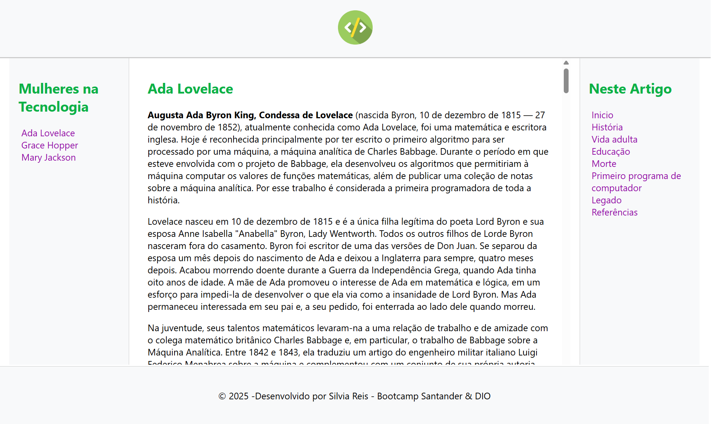
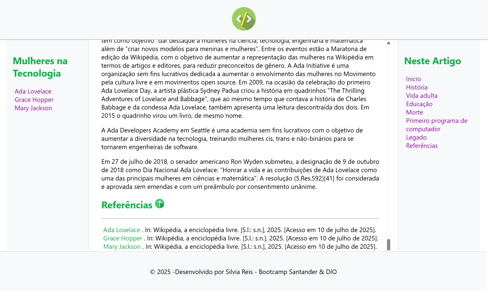

# 🌐 Wikipedia Modern UI Clone

Este é um projeto desenvolvido por **Silvia Reis** como parte do **Bootcamp Santander & DIO**. O desafio proposto consiste em criar uma página web inspirada no visual da Wikipédia, porém com um design mais moderno, responsivo e atraente.

---

## 📸 Prévia do Projeto

### Tela inicial



### Rodapé



---

## 🎯 Objetivo

Recriar a estrutura da Wikipédia com um layout moderno, mantendo a clareza do conteúdo, com uma apresentação mais elegante e acessível.

---

## 🛠️ Tecnologias Utilizadas

- ✅ **HTML5**  
- ✅ **CSS3**  
- ✅ **CSS Grid e Flexbox** para layout  

---

## 🧱 Estrutura do Projeto

```
📦 wikipedia-modern
 ┣ 📁 assets/                  # Imagens e recursos
 ┣ 📄 index.html               # Página principal
 ┣ 📄 style.css                # Estilos do projeto
 ┗ 📄 README.md                # Este arquivo
```

---

## 📚 Conteúdo Apresentado

A página apresenta uma biografia da pioneira da computação **Ada Lovelace**, com seções como:

- Início
- História
- Vida adulta
- Educação
- Legado
- Referências

Além disso, há navegação lateral com links para outras mulheres importantes na tecnologia:  
👩‍💻 **Grace Hopper**  
👩‍🚀 **Mary Jackson**

---

## 🧠 Aprendizados

Durante o desenvolvimento, pratiquei conceitos como:

- Estruturação semântica com HTML
- Layouts modernos com CSS Grid e Flexbox
- Organização e separação de conteúdo

---

## 🚀 Como Executar Localmente

1. Clone este repositório:
```bash
git clone https://github.com/Silviareis1/wikipedia-modern.git
```

2. Navegue até a pasta do projeto:
```bash
cd wikipedia-modern
```

3. Abra o arquivo `index.html` no navegador.

---

## 📌 Créditos

- Desenvolvido por **Silvia Reis**
- Projeto do **Bootcamp Santander & DIO**
- Conteúdo adaptado da [Wikipédia](https://pt.wikipedia.org/wiki/Wikip%C3%A9dia:P%C3%A1gina_principal)

---

© 2025 - Silvia Reis | Todos os direitos reservados
